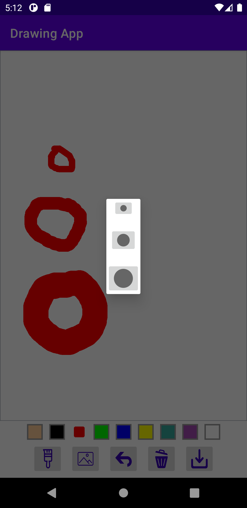

# Drawing App

## Details and Description

### Functionality
Drawing app alows you:
- to draw on the screen with a color pallete
- to choose a brush size
- toupload an image to use as a background
- to revert the changes on the screen (undo)
- clear the whole drawing
- save image to Android/Files
- share dialog to share an image via other applications (the functionality isn't fully implemented)

### App is using
- Activity and Dialog
- Custom View using Canvas and Path to allow drawing
- Constraint Layout
- Requests permissions to read and write to external storage which allows to select image from the phone photo gallery and save drawing image in PNG format
- Coroutines with ViewModel: asynchronous function handles creating bitmap from a view and saving the image to a storage without blocking the main thread 

### Screenshots

#### Main UI

#### Choose brush size dialog

#### Choose background image to draw on
